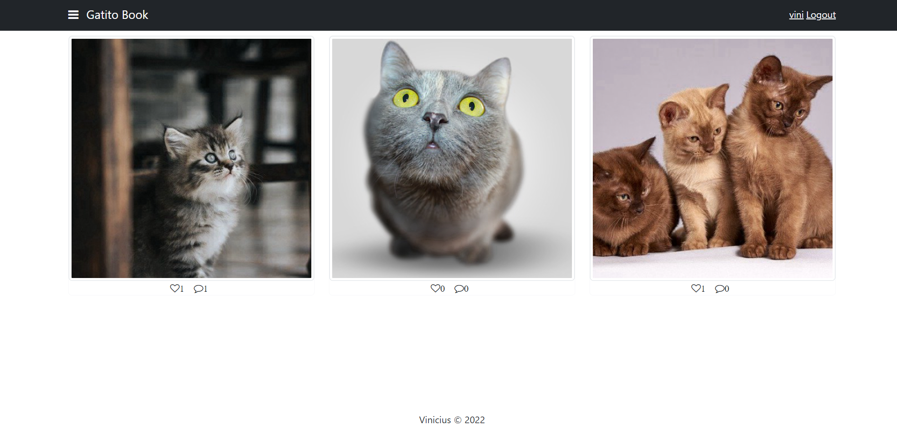
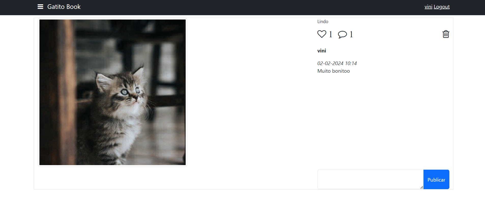

# Projeto GatitoBook

 

### ✌️ Para usar o projeto
- Node.js versão 14.21.3

* Abra a basta "gatitobook" no cmd, no terminal digite: 

~~~npm
npm i
~~~

~~~npm
npm start
~~~

* Repita o mesmo processo para a pasta "api" para rodar o back-end

### 📌 Funcionalidades

-[x] Cadastro, Login e Logout de Usuário
-[x] Autenticação com Token
-[x] Cadastro e exclusão de postagem
-[x] Listagem de cards de gatos
-[x] Permitir curtir e comentar nas fotos
-[x] Permissão de comentar ou não uma postagem.

### ⌨️ Tecnologias

As seguintes ferramentas foram usadas na construção do projeto:

- Angular 15
- Jwt
- Boostrap

### ⚠️ Atenção
Obs: A parte de back-end já peguei pronta, eu não desenvolvi.